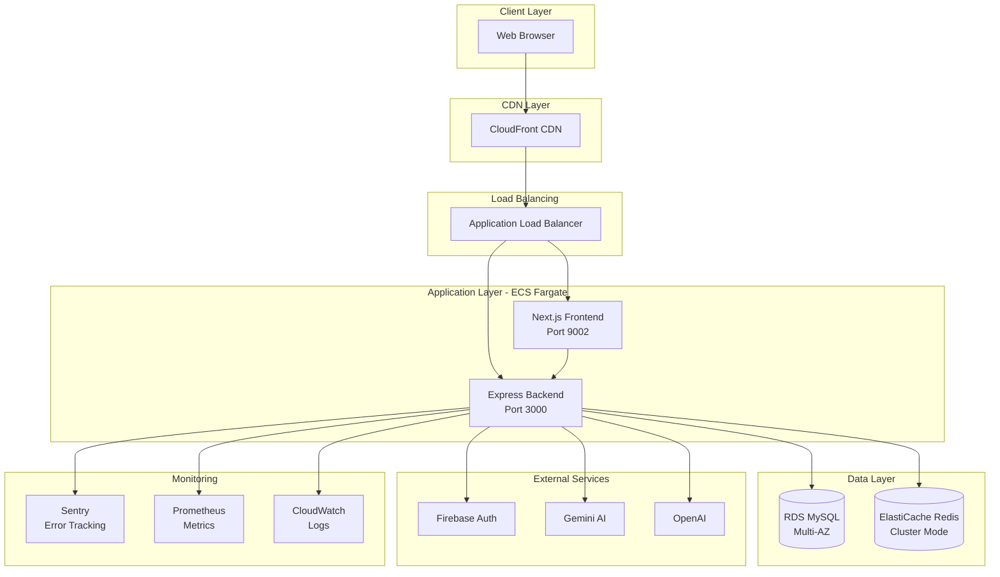
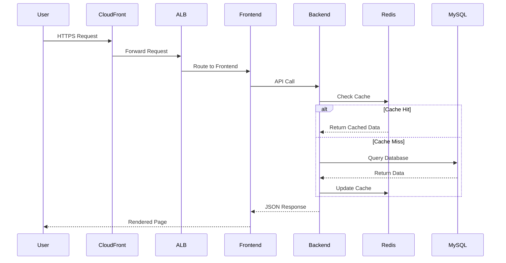
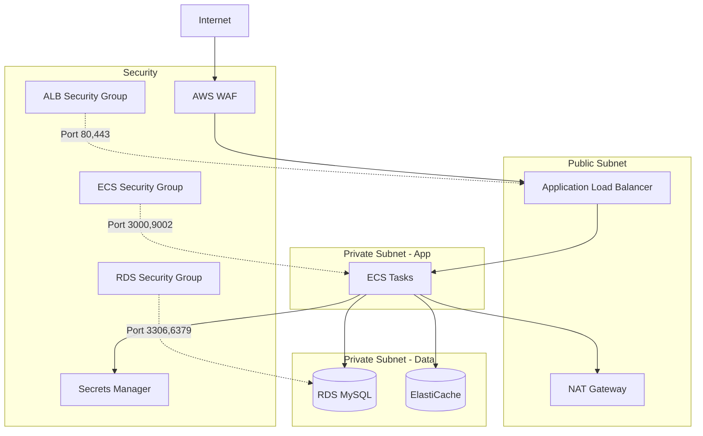

# System Architecture

## Overview

The CRM application follows a **Modular Monolith** architecture with clear separation between frontend and backend services.

---

## High-Level Architecture

---

## Component Details

### Frontend (Next.js)
- **Technology**: React 19, Next.js, TypeScript
- **Port**: 9002
- **Deployment**: ECS Fargate (2-10 instances)
- **Features**:
  - Server-side rendering
  - Static generation
  - API routes
  - Real-time updates (Socket.io)

### Backend (Express)
- **Technology**: Node.js, Express, TypeScript
- **Port**: 3000
- **Deployment**: ECS Fargate (2-10 instances)
- **Features**:
  - RESTful API
  - WebSocket support
  - Job scheduling
  - Rate limiting
  - Input validation

### Database (RDS MySQL)
- **Version**: MySQL 8.0
- **Configuration**: Multi-AZ
- **Backup**: Automated daily (7-day retention)
- **Encryption**: At rest and in transit

### Cache (ElastiCache Redis)
- **Version**: Redis 7.0
- **Configuration**: Cluster mode enabled
- **Use Cases**:
  - Session storage
  - Rate limiting
  - Real-time data
  - Job queues

---

## Data Flow

### User Request Flow

---

## Security Architecture

---

## Scaling Strategy

### Horizontal Scaling
- **Frontend**: 2-10 instances based on CPU/Memory
- **Backend**: 2-10 instances based on CPU/Memory
- **Database**: Read replicas (future)
- **Cache**: Cluster mode with auto-failover

### Auto-Scaling Triggers
- CPU > 70% → Scale up
- CPU < 30% → Scale down
- Memory > 80% → Scale up
- Request count > 1000/min → Scale up

---

## Disaster Recovery

### Backup Strategy
- **Database**: Automated daily backups (7-day retention)
- **Application**: Immutable Docker images in ECR
- **Configuration**: Infrastructure as Code (Terraform)

### Recovery Objectives
- **RTO** (Recovery Time Objective): < 1 hour
- **RPO** (Recovery Point Objective): < 15 minutes

### Failover Procedures
1. Multi-AZ RDS automatic failover
2. ECS tasks distributed across AZs
3. CloudFront edge caching
4. Terraform state for infrastructure recovery

---

## Technology Stack

### Frontend
- React 19
- Next.js 15
- TypeScript
- TailwindCSS
- Socket.io Client

### Backend
- Node.js 20
- Express
- TypeScript
- Prisma ORM
- Socket.io
- Bull (Job Queue)

### Infrastructure
- AWS ECS Fargate
- AWS RDS MySQL
- AWS ElastiCache Redis
- AWS Application Load Balancer
- AWS CloudFront
- Terraform

### Monitoring
- Sentry (Error Tracking)
- Prometheus (Metrics)
- CloudWatch (Logs)
- Grafana (Dashboards - optional)

---

## Performance Metrics

### Target SLAs
- **Availability**: 99.9% uptime
- **Response Time**: p95 < 500ms
- **Error Rate**: < 0.1%
- **Throughput**: > 1000 req/s

### Current Performance
- See [Monitoring Dashboard](../operations/monitoring.md)
