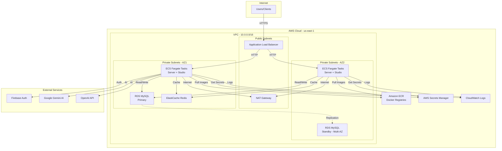

# AWS Infrastructure Architecture

## Overview

ApexAI CRM is deployed on AWS using a modern, scalable architecture with ECS Fargate, managed databases, and automated CI/CD.

## Architecture Diagram

## Components

### Network Layer

**VPC (Virtual Private Cloud)**
- CIDR: `10.0.0.0/16`
- 2 Availability Zones for high availability
- Public subnets: `10.0.0.0/24`, `10.0.1.0/24`
- Private subnets: `10.0.10.0/24`, `10.0.11.0/24`

**Internet Gateway**
- Provides internet access to public subnets
- Used by Application Load Balancer

**NAT Gateway**
- Allows private subnet resources to access internet
- Required for ECS tasks to pull images and call external APIs

### Compute Layer

**ECS Fargate Cluster**
- Serverless container orchestration
- No EC2 instances to manage
- Auto-scaling based on CPU utilization

**Server Service**
- Node.js/Express backend
- 2-10 tasks (auto-scaling)
- 512 CPU units, 1024 MB memory per task
- Health check: `/health` endpoint

**Studio Service**
- Next.js frontend
- 2-10 tasks (auto-scaling)
- 512 CPU units, 1024 MB memory per task
- Health check: `/` endpoint

### Load Balancing

**Application Load Balancer**
- Layer 7 (HTTP/HTTPS) load balancing
- Path-based routing:
  - `/api/*` → Server service
  - `/socket.io/*` → Server service
  - `/*` → Studio service
- Health checks with automatic failover
- Connection draining for zero-downtime deployments

### Data Layer

**RDS MySQL 8.0**
- Managed relational database
- Instance: `db.t3.micro` (dev), scalable for production
- Multi-AZ deployment for high availability (production)
- Automated backups (7-day retention)
- Encryption at rest
- Private subnet placement (not publicly accessible)

**ElastiCache Redis 7.0**
- Managed in-memory cache
- Used for:
  - Session storage
  - BullMQ job queues
  - Application caching
- Instance: `cache.t3.micro` (dev)
- Private subnet placement

### Container Registry

**Amazon ECR**
- Private Docker image repositories
- Separate repos for server and studio
- Image scanning on push
- Lifecycle policies (keep last 10 images)
- Encryption at rest

### Security & Secrets

**AWS Secrets Manager**
- Secure storage for:
  - Database credentials
  - Firebase configuration
  - API keys (Gemini, OpenAI)
- Automatic rotation support
- IAM-based access control

**Security Groups**
- ALB SG: Allow 80/443 from internet
- ECS SG: Allow 3000 from ALB only
- RDS SG: Allow 3306 from ECS only
- Redis SG: Allow 6379 from ECS only

**IAM Roles**
- ECS Task Execution Role: Pull images, write logs, read secrets
- ECS Task Role: Application runtime permissions

### Monitoring & Logging

**CloudWatch Logs**
- Centralized log aggregation
- Separate log groups for server and studio
- 7-day retention (configurable)
- Real-time log streaming

**CloudWatch Metrics**
- ECS service metrics (CPU, memory, task count)
- ALB metrics (request count, latency, errors)
- RDS metrics (connections, CPU, storage)
- Redis metrics (cache hits, memory usage)

**Container Insights**
- Enabled on ECS cluster
- Detailed container-level metrics
- Performance monitoring

## Traffic Flow

### User Request Flow

1. **User** makes HTTPS request to ALB DNS name
2. **ALB** terminates SSL and routes based on path:
   - API requests → Server target group
   - Frontend requests → Studio target group
3. **Target Group** distributes to healthy ECS tasks
4. **ECS Task** processes request:
   - Server: Queries RDS, caches in Redis, calls external APIs
   - Studio: Serves Next.js pages, makes API calls to server
5. **Response** flows back through ALB to user

### Deployment Flow

1. **Developer** pushes code to GitHub
2. **GitHub Actions** triggers on push to main/develop
3. **CI/CD Pipeline**:
   - Builds Docker images
   - Pushes to ECR
   - Updates ECS task definitions
   - Triggers rolling deployment
4. **ECS** performs zero-downtime deployment:
   - Starts new tasks with new image
   - Waits for health checks to pass
   - Drains connections from old tasks
   - Terminates old tasks

## High Availability

### Multi-AZ Deployment

- **ALB**: Deployed across 2 availability zones
- **ECS Tasks**: Distributed across 2 AZs
- **RDS**: Multi-AZ with automatic failover (production)
- **NAT Gateway**: Single NAT (dev), multi-NAT recommended for production

### Auto-Scaling

**ECS Services**
- Target CPU utilization: 70%
- Scale out: Add tasks when CPU > 70%
- Scale in: Remove tasks when CPU < 70%
- Min tasks: 2
- Max tasks: 10

**Database**
- RDS storage auto-scaling enabled
- Max storage: 2x allocated storage

### Disaster Recovery

**RDS Backups**
- Automated daily backups
- 7-day retention
- Point-in-time recovery
- Manual snapshots before major changes

**ECR Images**
- Lifecycle policy keeps last 10 images
- Manual tagging for production releases

## Security Best Practices

✅ **Network Isolation**
- Database and cache in private subnets
- No public IPs on ECS tasks
- All internet traffic through NAT Gateway

✅ **Encryption**
- RDS encryption at rest
- ECR encryption at rest
- Secrets Manager encryption
- ALB SSL/TLS termination (when configured)

✅ **Least Privilege IAM**
- Separate roles for task execution and runtime
- Minimal permissions for each role
- No hardcoded credentials

✅ **Security Groups**
- Whitelist-based ingress rules
- Minimal port exposure
- Service-to-service isolation

## Cost Optimization

### Development Environment

- Single NAT Gateway
- Single-AZ RDS
- Minimal task counts (2 each)
- Small instance sizes (t3.micro)
- **Estimated: $150-200/month**

### Production Recommendations

- Multi-NAT for HA (+$35/month)
- Multi-AZ RDS (+$15/month)
- Larger instances (+$100/month)
- Reserved instances (-30% on RDS)
- **Estimated: $300-500/month**

### Optimization Tips

1. Use auto-scaling to scale down during off-hours
2. Enable RDS reserved instances for 1-year commitment
3. Use CloudWatch alarms to monitor costs
4. Delete old ECR images regularly
5. Use S3 for static assets instead of ECS

## Scalability

### Horizontal Scaling

- **ECS**: Auto-scales from 2 to 10 tasks per service
- **ALB**: Automatically scales to handle traffic
- **RDS**: Read replicas can be added for read-heavy workloads

### Vertical Scaling

- **ECS**: Update task CPU/memory in Terraform
- **RDS**: Change instance class with minimal downtime
- **Redis**: Change node type with brief interruption

### Performance Tuning

- **Database**: Connection pooling in Prisma
- **Cache**: Redis for session and data caching
- **CDN**: Add CloudFront for static assets (future)
- **Compression**: Enable gzip in ALB

## Maintenance Windows

- **RDS**: Monday 04:00-05:00 UTC
- **Redis**: Monday 05:00-07:00 UTC
- **ECS**: Rolling deployments (no downtime)

## Future Enhancements

1. **HTTPS with ACM**: Add SSL certificate and HTTPS listener
2. **CloudFront CDN**: Distribute static assets globally
3. **WAF**: Add Web Application Firewall for security
4. **Route 53**: Custom domain with health checks
5. **X-Ray**: Distributed tracing for debugging
6. **Aurora Serverless**: Consider for variable workloads
7. **Fargate Spot**: Use spot instances for cost savings
